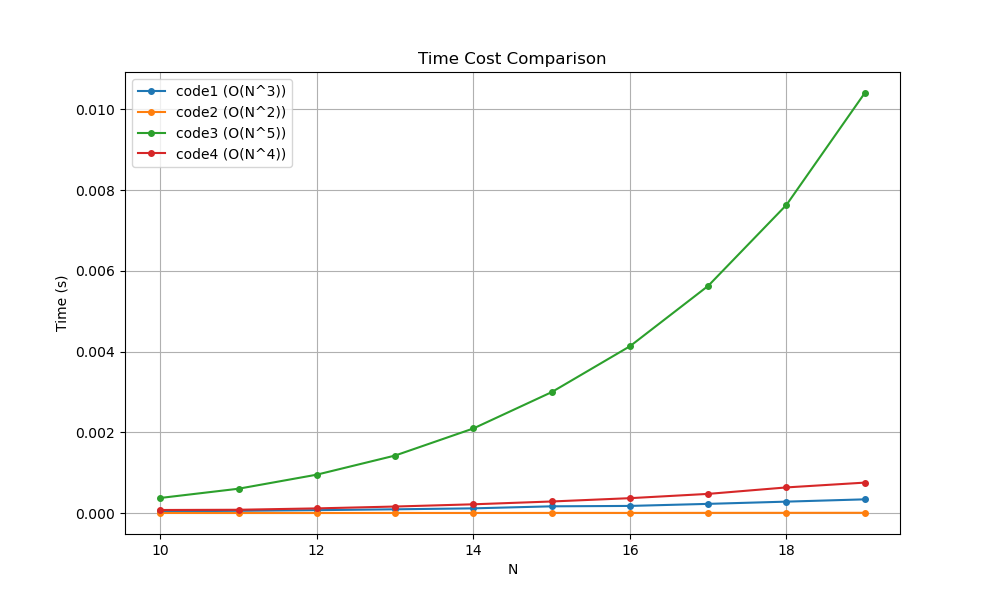

# Homework 1

> about `introduction`, `alorithm`, `recursion`, `array`, `linked list` and `stack`

## Question 1

写一段 python 程序，计算 `1 + 2 + 3 + ... + 1,000,000` 输出计算所需时间。

**Solution** 代码见 [hw1_1_calculate_time.py](hw1_1_calculate_time.py)

## Question 2

将下列函数按增长速度进行排序，并指出增长速度相同的函数：

$N$ ， $N^{\frac{1}{2}}$ ， $N^{1.5}$ ， $N^2$ ， $N\log N$ ， $N\log (\log N)$ ， $N(\log N)^2$ ， $N\log N^2$ ， $2^N$ ， $2^{N/2}$ ， $37$ ， $N^2 \log N$ ， $N^3$

**Solution** 首先有 $O(c^N) > O(N^3) > O(N^2) > O(N \log N) > O(N) > O(1)$ ，其次还有 $O(c\ \cdot) = O(\cdot)$ 。所以容易判断：

- $O(37) = O(1)$ 
-  $O(N\log N^2) = O(2\cdot N\log N) = O(N \log N)$ 

为方便起见，相同速率的后面只写一个代表性的表达式。

- 幂次排序简单： $N^3 > N^2 > N^{1.5} > N > N^{\frac{1}{2}}$ 

- 指数的排序为： $2^{N/2} = (\sqrt{2})^N < 2^N$

- 因为对数增长比一次方慢，所以有： $N^2 \log N > N(\log N)^2 > N \log N > N \log (\log N)$

而有结论 $\lim\limits_{N \to \infty}\ \dfrac{\log N}{N^c} = 0,\quad \text{when  } c > 0$ 。故最后，增长速度排序为（省略 $O(\cdot)$ 符号）：

$2^N > 2^{N/2} > N^3 > N^2 \log N > N^2 > N^{1.5} > N (\log N)^2 > N \log N > N \log(\log N) > N > N^{\frac{1}{2}} > 37$


## Question 3

对下列 4 段程序：

`a)` 分析其运行时间，用大 $O(\cdot)$ 符号表示

`b)` 在 Python 中运行这些程序，给出 `N` 取不同的几个值时的运行时间

`c)` 将你的时间复杂度分析与实际运行时间相比较，它们是否是一致的？

程序为：

```python
def code1(N):
    sum = 0
    for i in range(N):
        for j in range(N * N):
            sum += 1


def code2(N):
    sum = 0
    for i in range(N):
        for j in range(0, i * N, N):
            sum += 1


def code3(N):
    sum = 0
    for i in range(N):
        for j in range(i * i):
            for k in range(j):
                sum += 1


def code4(N):
    sum = 0
    for i in range(N):
        for j in range(i * i):
            if j % i == 0:
                for k in range(j):
                    sum += 1
```

**Solution (a)** 

- 对于 `code1` 加和操作在第二次循环经历了 $N \times N$ 次，而整个循环在第一层循环又经历了 $N$ 次，所以复杂度为 $O(N^3)$ 。
- 对于 `code2` 加和操作在第二次循环以 $N$ 为跨度从 $0$ 到 $i\cdot N$ 故循环了 $i$ 次。而 $i$ 在第一次循环里从 $0$ 到 $N - 1$ 。故大约复杂度为 $O(0 + 1 + 2 +\cdots + N - 1) = O(N^2)$ 。
- 对于 `code3` 加和操作在 `k` 循环里执行 $j$ 次，而 `k` 循环在 `j` 循环里执行 $i^2$ 次，而 `i` 在循环从 $0$ 到 $N - 1$ 。故复杂度 $O(\sum\limits_{i=0}^{N-1} \sum\limits_{j = 0}^{i^2}\sum\limits_{k = 0}^j 1) = O(\sum\limits_{i=0}^{N-1} \sum\limits_{j = 0}^{i^2} j) = O(\sum\limits_{i=0}^{N-1} i^2 \cdot i^2) = O(N^5)$ 。
- 对于 `code4` 最里面的 `k` 循环只有当 `j` 是 `i` 倍数时才执行。而 `j` 从 $0$ 到 $i^2$ ，共 `i` 个倍数关系，故 `k` 的循环只会执行 `i` 次。而 `j` 实际只有当其为 `i` 的倍数时才会进入里层循环，而这样的 `j` 有 $i$ 个。故复杂度 $O(\sum\limits_{i = 0}^{N -1}\sum\limits_{k = 0}^{i - 1} ki) = O(\sum\limits_{i = 0}^{N -1} i\cdot i^2) = O(N^4)$ 。

**Solution (b) (c)**

```python
def time_cost(f, N):
    import time
    start = time.time()
    f(N)
    end = time.time()
    return end - start


if __name__ == '__main__':
    res = []
    scale = 1
    length = 10
    N_values = range(10, 10 + length * scale, scale)
    names = [code1, code2, code3, code4]
    for name in names:
        tmp = []
        for N in N_values:
            tmp.append(time_cost(name, N))
        res.append(tmp)
    print(res)

    # 绘图
    plt.figure(figsize=(10, 6))
    labels = ['code1 (O(N^3))', 'code2 (O(N^2))', 'code3 (O(N^5))', 'code4 (O(N^4))']

    for i in range(len(names)):
        plt.plot(N_values, res[i], marker='o', markersize=4, label=labels[i])

    plt.xlabel('N')
    plt.ylabel('Time (s)')
    plt.title('Time Cost Comparison')
    plt.legend()
    plt.grid(True)
    plt.show()
```

结果图示为




## Question 4

**汉诺塔问题** 一个古老的印度神庙里有 3 根柱，其中一个自上而下放置了由小到大的 64 个金盘。僧侣们依照以下规则把 64 个金盘移动到另一个柱子上：
- 一次只能移动一个金盘；
- 金盘只能在柱子上存放；
- 小盘必须始终放置在大盘上方；

请设计并用 Python 实现算法，接收用户输入的金盘数目 N 输出将金盘从柱子 0 移动到柱子 2 的全过程。
输出格式为：`move(a, x, y)`，其中 a 为盘子编号（1 ~ N），x 和 y 为柱子编号（0 ~ 2），表示将盘子 a 从柱子 x 移动到柱子 y。

**Solution** 代码见 [hw1_4_hanoi.py](hw1_4_hanoi.py)

## Question 5

请编写一个 python 函数，将两个有序的单向链表合并为一个有序链表，合并后使原链表为空。
链表的节点结构参考课件中的单向链表节点，且链表带有哨兵节点作为头节点。
有序链表中元素为从小到大排列。

**Solution** 代码见 [hw1_5_merge_linked_list.py](hw1_5_merge_linked_list.py)

## Question 6

**快慢指针** 假设一个单链表类使用的节点与课件中的节点相同，但并未记录链表中节点的数目。
请为该类添加一个方法，该方法用于高效找到链表的中间节点。
若链表长度为偶数，则返回两个中间节点中靠后的那一个。

**Solution** 代码见 [hw1_6_fast_slow_point.py](hw1_6_fast_slow_point.py)

## Question 7

如果 3 个元素进栈顺序为 X、Y、Z，试写出所有可能的出栈顺序（可能后来者进栈时，先来者已经出栈）。

**Solution** 根据枚举法可得，出栈顺序为：

```python
['X', 'Y', 'Z']
['X', 'Z', 'Y']
['Y', 'X', 'Z']
['Y', 'Z', 'X']
['Z', 'Y', 'X']
```

代码见 [hw1_7_stack_backtracking.py](hw1_7_stack_backtracking.py)

## Question 8

**N 皇后问题** 在 NxN 格的国际象棋上摆放 N 个皇后，使其不能互相攻击，即任意两个皇后都不能处于同一行、同一列或同一斜线上，问有多少种摆法？

**Solution** 代码见 [hw1_8_nqueens.py](hw1_8_nqueens.py)