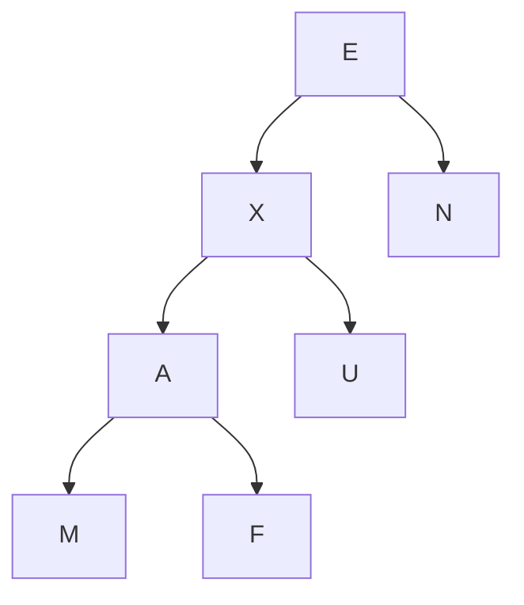

# Homework 2

> about `linked list` `tree` `binary tree` `priority queue` `heap` and `heap sort`

## Question 1

请写出：完整的基于数组的双端队列的 python 实现。

**Solution** 代码见 [hw2_1_dequeue.py](hw2_1_dequeue.py)

## Question 2

一棵共有 $n$ 个节点的树，其所有内部结点的度都为 $k$，求该树的叶子节点数。

**Solution** 因为叶子节点的度为 $d_{leaf} = 0$ ，而所有内部节点的度都为 $d_{i} = k$ 。于是根据节点度和总节点数的关系：

$$
\sum\limits_{i=1}^{n}\ d_i = n-1
$$

有内部节点的节点数为 $\frac{n-1}{k}$ ，从而叶子节点的数目为：

$$
n_{leaf} = n - \frac{n-1}{k}
$$

> 注意：这里的除法不用取整，因为若这个树存在，则 $n-1$ 必定是 $k$ 的倍数。

## Question 3

假设某完全二叉树共有 $2025$ 个节点，请问：

1. 该二叉树有多少层？
2. 它有多少个叶子节点？
3. 它有多少个度为 $2$ 的节点？

**Solution 1** 由于完全二叉树一定是尽可能的每层排满，加之 $2^{11} \geq2025 = 2^{11} - 23 \geq 2^{10}$ 故这个完全二叉树共 $11$ 层。且前 $10$ 层每层均满足 $2^i$ 个节点。

**Solution 2** 由于这个完全二叉树前 $10$ 层每层均满足 $2^i$ 个节点，故前十层的节点数为：

$$
1 + 2 + 2^2 + \cdots + 2^{9} = 2^{10} - 1
$$

最后一层全是叶子节点，共 $2025 - (2^{10} - 1) = 1002$ 个叶子节点。而倒数第二层，有 $2^9 - 1002/2 = 11$ 个叶子节点。所以总共有 $1002 + 11 = 1013$ 个叶子节点。

**Solution 3** 对于二叉树而言，设叶子节点数为 $n_0$，度为 $2$ 的节点数为 $n_2$ ，则有：

$$
n_0 = n_2 + 1
$$

所以度为 $2$ 的节点数目为 $1013 - 1 = 1012$ 。

## Question 4

请画出一棵二叉树 T，使其同时满足如下条件：

- 树 T 的每个内部节点存储一个字符
- 对树 T 前序遍历产生 `EXAMFUN`
- 对树 T 中序遍历产生 `MAFXUEN`

**Solution** 存储的元素为 `[E, X, A, M, F, U, N]` 需要前序、中序遍历不同。



如上图所示：对树 T 前序遍历产生 `EXAMFUN` ；对树 T 中序遍历产生 `MAFXUEN` 。

## Question 5

**Solution** 完整的类定义见代码 [hw2_5_linked_binary_tree.py](hw2_5_linked_binary_tree.py)

```python
    # ==================== 覆写 _delete 方法 ====================
    def _delete(self, p):
        """删除节点 p 用其孩子替代。当 p 非法或有两个孩子则报错"""
        if not isinstance(p, self._Node):  # p is not valid
            raise TypeError('p must be proper _Node type')

        if self.num_children(p) == 2:  # p 有 2 个孩子
            raise ValueError('p has two children')

        # 取 p 的孩子节点
        child = p._left if p._left is not None else p._right

        if child is not None:  # [这一步无需判断 p 是否为根节点]
            # 子节点连接父节点的父节点
            child._parent = p._parent  # 根节点的父节点为哨兵节点

        # 更新父节点的父节点的孩子节点
        parent = p._parent
        if p is parent._left:
            parent._left = child
        else:
            parent._right = child

        self._size -= 1  # 节点数减一
        p._parent = p  # p 被删除，惯例：self.parent -> self
        return p._element
    # ==========================================================
```

## Question 6

在序列 `3, 1, 4, 7, 5, 9, 2, 6, 8` 上进行**原地选择排序**和**原地插入排序**，并画出排序过程（每一步排好一个元素）。 对这两种排序方式计算其对元素进行大小比较的操作次数，并进行对比。

**Solution** 不妨设最终结果为从小到大排序：

原地选择排序：`|` 左边为已经排序好的序列，右边为未排序的原序列。寻找最小元素每次都需要遍历剩余的序列，即比较次数共 $9 + 8 + \cdots + 1 = 45$ 。每次比较完后需要与完成排序的列表最后一个元素进行交换（即下面的 `|` 前的数），大约共 $8$ 次。

其他的操作都忽略，故选择排序共 $45 + 8 = 53$ 次。

```python
3 1 4 7 5 9 2 6 8
->
1 | 3 4 7 5 9 2 6 8
->
1 2 | 4 7 5 9 3 6 8
->
1 2 3 | 7 5 9 4 6 8
->
1 2 3 4 | 5 9 7 6 8
->
1 2 3 4 5 | 9 7 6 8
->
1 2 3 4 5 6 | 7 9 8
->
1 2 3 4 5 6 7 | 9 8
->
1 2 3 4 5 6 7 8 | 9
->
1 2 3 4 5 6 7 8 9 |
```

原地插入排序：`|` 左边为已经排序好的序列，右边为未排序的原序列。对于选择排序，每次都将 `|` 右边的第一个数入队，然后向前比较，找到比它小的数字，插入到后面。如此，第一次比较了 0 次（3 就是第一个元素，直接入队）；第二次比较了 1 次（1 < 3）；第三次比较了 1 次（4 > 3）；第四次比较了 1 次（7 > 4）；第五次比较了 2 次（5 > 4）；第六次比较了 1 次（9 > 7）；第七次比较了 3 次（6 > 5）；第八次比较了 2 次（8 > 7）。故总共比较了 $0 + 1 + 1 + 1 + 2 + 1 + 3 + 2 = 11$ 次，加上交换的次数 $8$ 次数。

其他的操作都忽略，故插入排序共 $11 + 8 = 19$ 次。

```python
3 1 4 7 5 9 2 6 8
->
3 | 1 4 7 5 9 2 6 8
->
1 3 | 4 7 5 9 2 6 8
->
1 3 4 | 7 5 9 2 6 8
->
1 3 4 7 | 5 9 2 6 8
->
1 3 4 5 7 | 9 2 6 8
->
1 3 4 5 7 9 | 2 6 8
->
1 2 3 4 5 7 9 | 6 8
->
1 2 3 4 5 6 7 9 | 8
->
1 2 3 4 5 6 7 8 9 |
```

综上可知，插入排序比选择排序在一般情况下要高效。（$19 < 53$）


## Question 7

给出类 `HeapPriorityQueue` 中 `_upheap` 和 `_downheap` 方法的非递归实现。

**Solution** 完整代码见 [hw2_7_heap_priority_queue.py](hw2_7_heap_priority_queue.py)

```python
    # ==================== 覆写 _upheap 方法 ====================
    def _upheap(self, j):
        """向上冒泡"""
        cur = j
        parent = self._parent(j)  # j 的父节点
        while cur > 0 and self._data[cur] < self._data[parent]:  # 非根节点/不满足 Heap-Order
            self._swap(cur, parent)  # 冒泡/交换

            cur = parent  # go ahead -> cur 变为父节点
            parent = self._parent(cur)  # 同理，继续向上冒泡

    # =================== 覆写 _downheap 方法 ===================
    def _downheap(self, j):
        """向下冒泡"""
        cur = j
        # 找到最小的子节点 small_child
        while self._has_left(cur):  # 直到叶子节点 (完全二叉树，没有 left 就一定没有 right)
            left = self._left(cur)  # 左/非叶节点
            small_child = left

            if self._has_right(cur):  # 右/非叶节点
                right = self._right(cur)
                if self._data[right] < self._data[left]:
                    small_child = right

            # 不满足 Heap-Order
            if self._data[small_child] < self._data[cur]:
                self._swap(small_child, cur)  # 冒泡/交换

                cur = small_child  # 向下走一步
            else:  # 满足 Heap-Order 提前结束
                break

    # ==========================================================
```


## Question 8

请你设计一个算法，高效地完成 **“在无序列表中寻找最大的 k 个元素”** 这一任务。要求：该算法的复杂度为 $O(n + k\cdot \log n)$ 或 $O(n\cdot\log k)$ 。（提示：使用堆结构）

**Solution** 完整代码见 [hw2_8_nlargest.py](hw2_8_nlargest.py)

**$O(n + k\cdot \log n)$ 的算法：** 先将序列的 $n$ 个元素自底向上的原地构建 *最大堆* ，复杂度为 $O(n)$ 。然后再一个一个的将堆顶元素（最大堆堆顶为最大值）出队，这一步的复杂度为 $O(k\cdot \log n)$ 。所以算法复杂度为 $O(n + k\cdot \log n)$ 。第二步可细分为：先取得堆顶元素，然后将堆顶元素和最后一个节点交换，最后进行向下冒泡 downheap 使得满足 Heap-Order 性质。

**代码见下：** 特别地，向下冒泡函数 `downheap()` 定义见最后。堆是基于数组实现，采用原地变换。

```python
def nlargest1(k: int, arr: list) -> list:
    """
    原地找出 k 个最大元素 in-place `O(n + k log n)`
    :param k: 个数
    :param arr: 序列
    :return: arr 中最大的 k 个元素
    """
    n = len(arr)
    if n < k:  # 检查是否越界
        raise IndexError('Out of the range!')

    """自底向上构建最大堆 O(n)"""
    if n > 1:
        # 自底向上构建最大堆（从最后一个非叶子节点开始）
        for i in range((n // 2) - 1, -1, -1):
            # <=> 整个序列为一个暂未满足 heap-order 的堆，进行冒泡调整
            downheap(arr, cur=i, start=0, end=n, top_is_max=True)  # 自底向上的构建

    """最大元素根节点出堆 O(k log n)"""
    res = []  # 存储结果

    def get_max(size):
        """
        获取堆的根节点，即 max 并交换根节点和最后节点后向下冒泡
        :param size: [0, size) 为堆的范围
        :return: 最大值 max
        """
        max_element = arr[0]  # get the max
        arr[0] = arr[size]  # 交换根节点和最后节点
        arr[size] = None  # convention 置空 None 表示删除

        downheap(arr, cur=0, start=0, end=size)  # 向下冒泡使得 heap-order

        return max_element

    for _ in range(k):
        res.append(get_max(n - 1))  # 添加最大值
        n -= 1  # 同时减少堆大小

    return res
```

**$O(n\cdot \log k)$ 的算法：** 先将序列的前 $k$ 个元素自底向上的构建 *最小堆* ，复杂度为 $O(k)$ 。然后将剩下的 $n-k$ 个元素逐个和堆顶元素比较，如果更大，则替换掉栈顶元素，同时进行向下冒泡 downheap 使得满足 heap-order 性质，这一步的复杂度为 $O((n-k)\cdot \log k)$ 。最后这个 $k$ 个元素的堆就存储了序列前 $k$ 大的值，可以直接输出。或者为了由大到小输出，可以再加一个先右子节点再左子节点的后序遍历 postorder ，这一步的复杂度为 $O(k)$ 。所以，无论是否后序遍历输出，还是直接输出，时间复杂度都为 $O(k + (n-k)\cdot \log n + k) \sim O(n\cdot \log k)$ 。

**代码见下：** 特别地，向下冒泡函数 `downheap()` 定义见最后。堆是基于数组实现，采用原地变换。

```python
def nlargest2(k: int, arr: list) -> list:
    """
    原地找出 k 个最大元素 in-place `O(n log k)`
    :param k: 个数
    :param arr: 序列
    :return: arr 中最大的 k 个元素
    """
    n = len(arr)
    if n < k:  # 检查是否越界
        raise IndexError('Out of the range!')

    """arr 前 k 个自底向上构建最小堆 O(k)"""
    if k > 1:
        # 自底向上构建最小堆（从最后一个非叶子节点开始）
        for i in range((n // 2) - 1, -1, -1):
            # <=> 整个序列为一个暂未满足 heap-order 的堆，进行冒泡调整
            downheap(arr[:k], cur=i, start=0, end=k, top_is_max=False)  # 自底向上的构建 root is min

    """剩下 n - k 个元素逐个与根节点比较，更大则加入 O((n - k) log k)"""
    # 因为此时的堆顶为 k 个元素的 min
    for j in range(k, n):
        if arr[j] > arr[0]:  # 更大则加入 k-堆 并冒泡使得 heap-order
            arr[0], arr[j] = arr[j], arr[0]  # 交换
            downheap(arr, cur=0, start=0, end=k, top_is_max=False)
    # 如此得到 k-堆 存储着最大的 k 个元素

    """按序返回 k 个最大值 O(k)"""
    res = []

    def postorder(cur, heap_size):
        """
        后序遍历，不过先右再左：右 -> 左 -> 根
        :param cur: 开始遍历的位置
        :param heap_size: 堆大小
        :return: 前 k 个最大值
        """

        if cur >= heap_size:  # 到叶子节点，跳出
            return

        # 先右子节点
        right = 2 * cur + 2
        postorder(right, heap_size)

        # 再左子节点
        left = 2 * cur + 1
        postorder(left, heap_size)

        # 最后根节点
        res.append(arr[cur])

    # 后序遍历得到最终的 res
    postorder(cur=0, heap_size=k)
    return res
```

`downheap()` 函数定义：

```python
def downheap(arr, cur, start, end, top_is_max=True):
    """从 cur 开始向下冒泡，堆的范围是 [start, end)
    :param cur: 当前节点
    :param start: 堆的起始索引
    :param end: 堆的终止索引
    """
    parent = cur

    left = 2 * parent + 1
    right = 2 * parent + 2

    if top_is_max:
        # 堆的根节点为 max
        largest_child = parent
        if start < left < end and arr[left] > arr[largest_child]:
            largest_child = left
        if start < right < end and arr[right] > arr[largest_child]:
            largest_child = right

        if largest_child == parent:
            return None  # 如果父节点已经是最大的，停止

        arr[parent], arr[largest_child] = arr[largest_child], arr[parent]
        downheap(arr, cur=largest_child, start=0, end=end)  # 继续向下冒泡
    else:
        # 堆的根节点为 min
        smallest_child = parent
        if start < left < end and arr[left] < arr[smallest_child]:
            smallest_child = left
        if start < right < end and arr[right] < arr[smallest_child]:
            smallest_child = right

        if smallest_child == parent:
            return None  # 如果父节点已经是最大的，停止

        arr[parent], arr[smallest_child] = arr[smallest_child], arr[parent]
        downheap(arr, cur=smallest_child, start=0, end=end)  # 继续向下冒泡
```

一个示例：

```python
if __name__ == '__main__':
    print("=" * 15, "nlargest1: O(n + k log n)", "=" * 15)
    l = [3, 1, 4, 7, 5, 9, 2, 6, 8]
    k = 3
    res1 = nlargest1(k, l)
    print(res1)
    # print(l)  # for Debug

    print("=" * 15, "nlargest2: O(n log k)", "=" * 15)
    l = [3, 1, 4, 7, 5, 9, 2, 6, 8]
    k = 3
    res2 = nlargest2(k, l)
    print(res2)
    # print(l)  # for Debug
```

```python
=============== nlargest1: O(n + k log n) ===============
[9, 8, 7]
=============== nlargest2: O(n log k) ===============
[9, 8, 7]
```
