# Homework 2

> about `map` `hash` `search tree` `AVL` `sort` `merge & quick sort` and `select`

## Question 1

给定哈希函数 $H(k) = k \mod M$，哈希表长 $M = 13$ 。

1. 现有关键字 25，37，52，43，84，99，15，70，11。构造采用线性探测法进行冲突处理的哈希表，并把关键字填入表中，同时填入冲突次数。
2. 计算此哈希表的负载因子。
3. 如果从表中删除 70 和 11，请问需要进行多少次比较？

**Solution 1** 

在这个例子中，只有关键字 11 出现了冲突，分别在索引 11，12，0 处发生冲突。

如果冲突次数指的是不同位置发生冲突的次数则为：

|  序号 $i$  |  0   |  1   |  2   |  3   |  4   |  5   |  6   |  7   |  8   |  9   |  10  |  11  |  12  |
| :--------: | :--: | :--: | :--: | :--: | :--: | :--: | :--: | :--: | :--: | :--: | :--: | :--: | :--: |
| 关键字 $k$ |  52  |  11  |  15  |      |  43  |  70  |  84  |      |  99  |      |      |  37  |  25  |
|  冲突次数  |  1   |      |      |      |      |      |      |      |      |      |      |  1   |  1   |

如果冲突次数指的是关键字的总冲突次数，则为：

|  序号 $i$  |  0   |  1   |  2   |  3   |  4   |  5   |  6   |  7   |  8   |  9   |  10  |  11  |  12  |
| :--------: | :--: | :--: | :--: | :--: | :--: | :--: | :--: | :--: | :--: | :--: | :--: | :--: | :--: |
| 关键字 $k$ |  52  |  11  |  15  |      |  43  |  70  |  84  |      |  99  |      |      |  37  |  25  |
|  冲突次数  |      |  3   |      |      |      |      |      |      |      |      |      |      |      |

**Solution 2** 负载因子计算如下：
$$
\lambda = \frac{n}{N} = \frac{9}{13} = 0.6923077
$$
**Solution 3** 计算哈希函数值可知 $H(70) = 5,\quad H(11) = 11$ 

对于 70 ，在索引 5 处恰好找到值，直接删除，只比较了 $1$ 次；

但对于 11 ，在索引 11 处产生冲突，线性探测法向后探测，直到索引 1 处，共比较了 $4$ 次。

所以总共需要比较 $1 + 4 = 5$ 次。

## Question 2

使用不同的开放寻址法改写类 `ProbeHashMap` 中的 `_find_slot` 函数

1. 二次探测法
2. 再哈希法

**Solution 1** 

二次探测法（quadratic probing）：冲突发生时，尝试依次探测以下位置，直到发现一个空位置：
$$
[\ h(k) + f(i)\ ] \mod N,\quad i = 0,\ 1,\ 2,\ \cdots
$$
其中 $h(k)$ 为哈希码，对于线性探索 $f(i) = i$ 但对于二次探索则 $f(i) = i^2$ 。

完整 `ProbeHashMap` 类的代码见  [hw3_2_probe_hash_map.py](hw3_2_probe_hash_map.py) ，具体 `_find_slot` 方法的实现代码为：

```python
class ProbeHashMap(HashMapBase):
    ...
	def _find_slot(self, j, k):
        """二次探测：在桶/索引 j 中搜寻含义键 k 的元组"""
        firstAvail = None
        i = 1  # 步长，对于线性探测 i 恒等于 0
        while True:
            if self._is_available(j):  # 如果可以插入: _table[j] 是 None 或 _AVAIL
                if firstAvail is None:
                    firstAvail = j  # 记录可以插入的桶/索引
                if self._table[j] is None:
                    return (False, firstAvail)  # 没有找到匹配的 k -> False

            elif k == self._table[j]._key:  # 找到匹配的 k -> True
                return (True, j)  # 并且返回此处的索引

            j = (j + i * i) % len(self._table)  # 向后探索，二次探测 i^2 的步长
            i += 1
```

**Solution 2** 

双重哈希法/再哈希法（double hashing）：使用第二个哈希函数 $h'(k)$ 确定下一个探测的位置。具体来说，冲突发生时，依次探索以下位置，直到发现一个空位置：
$$
h(k) + i\cdot h'(k) \mod N,\quad i = 0,\ 1,\ 2,\ \cdots
$$
第二个哈希函数 $h'(k) \neq 0$ 以避免原地寻找。哈希表的长度 $N$ 应保证为质数，以使得所有位置都可被探测到。常用的第二个哈希函数 $h'(k)$ 为：

$$
h'(k) = q - (k \mod q)
$$
其中 $q < N$ 且为质数。

完整 `ProbeHashMap` 类的代码见  [hw3_2_probe_hash_map.py](hw3_2_probe_hash_map.py) ，具体 `_find_slot` 方法的实现代码见下。同时，因为键值 `k` 不一定为整数，所以需要先使用 `hash()` 函数。

```python
class ProbeHashMap(HashMapBase):
    ...
	def _double_hash(self, k):
        """计算双重哈希的步长 h'(k) = q - (hash(k) % q)"""
        return self._q - (hash(k) % self._q)

    def _find_slot(self, j, k):
        """双重哈希：在桶/索引 j 中搜寻含义键 k 的元组"""
        firstAvail = None
        i = 1  # 步长

        while True:
            if self._is_available(j):  # 如果可以插入: _table[j] 是 None 或 _AVAIL
                if firstAvail is None:
                    firstAvail = j  # 记录可以插入的桶/索引
                if self._table[j] is None:
                    return (False, firstAvail)  # 没有找到匹配的 k -> False

            elif k == self._table[j]._key:  # 找到匹配的 k -> True
                return (True, j)  # 并且返回此处的索引

            j = (j + i * self._double_hash(k)) % len(self._table)  # 再哈希法
            i += 1
```

对于再哈希法，比较特殊，需要考虑如何寻找 $q < N$ 的质数 $q$ 。在初始化实例时，需要存储 `self._q` 

```python
class ProbeHashMap(HashMapBase):
    """开放寻址法实现的哈希表"""
    _AVAIL = object()  # 哨兵对象，用来标记区分与空位置 None

    def __init__(self):
        super().__init__(cap=11, p=109345121)

        # 双重 hash 时，计算 q < N 的质数 q
        self._q = self._get_prime_less_than_N()
	...
```

其中 `_get_prime_less_than_N()` 方法用来返回小于 $N$ 的最大质数，实现如下：

```python
class ProbeHashMap(HashMapBase):
    ...
	def _is_prime(self, n):
        """检查是否为质数"""
        if n <= 1:
            return False
        if n == 2:
            return True
        if n % 2 == 0:
            return False

        # 检查到 sqrt(n)
        for i in range(3, int(math.sqrt(n)) + 1, 2):
            if n % i == 0:
                return False
        return True

    def _get_prime_less_than_N(self):
        """找到最大的 q < N 其中 q 为质数"""
        N = len(self._table)

        if N <= 2:
            return None

        # 从 N-1 开始反向检查
        for num in range(N - 1, 1, -1):
            if self._is_prime(num):
                return num
        return None
```

特别地，考虑到哈希表扩展，需要覆写父类方法 `_resize()` ，一定要在新的 `self._table` 扩大后立刻更新 `self._q` ：

```python
class ProbeHashMap(HashMapBase):
    ...
    def _resize(self, c):
        """覆写：扩展空间, 更新 self._q"""
        old = list(self.items())  # 继承自 MutableMapping 类

        self._table = c * [None]  # 扩容至 c
        self._q = self._get_prime_less_than_N()  # 【更新 q】
        self._n = 0
        
        for (k, v) in old:
            self[k] = v  # 利用已经定义的 __setitem__
```

## Question 3

按照 AVL 树构造的规则，将以下序列顺序插入 AVL 树：3，2，1，4，5，6，7，10，11，12，13，14，15，16，8，9。

**Solution**

插入 3 作为根节点

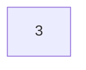

插入 2 ，因为 2 < 3 所以在左子树

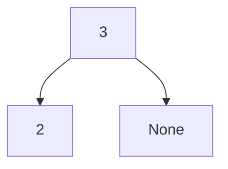

插入 1 ，不平衡，旋转

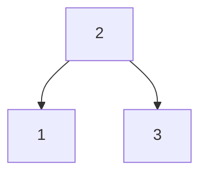

插入 4

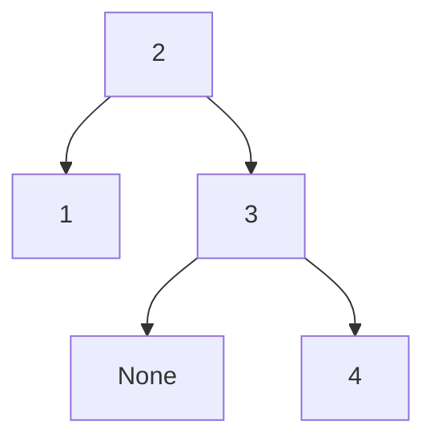

插入 5 ，在 3 产生不平衡，重构

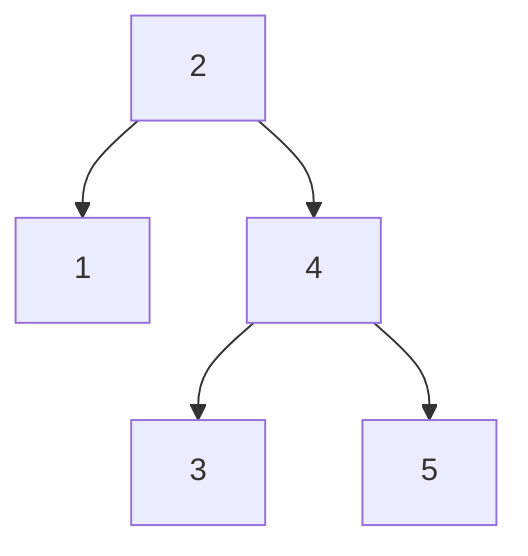

插入 6 ，在 2 不平衡，重构

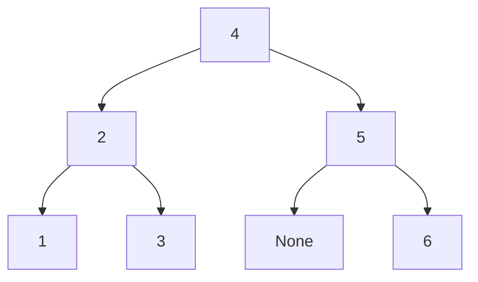

插入 7 ，在 5 处不平衡，重构

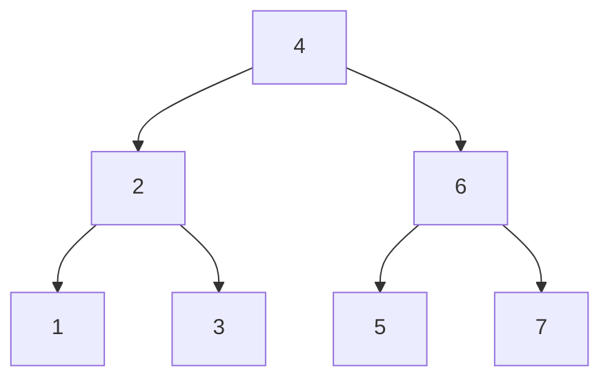

类似地插入 10，11，12，13，14，15，16，8，9 最终得到下图结构：

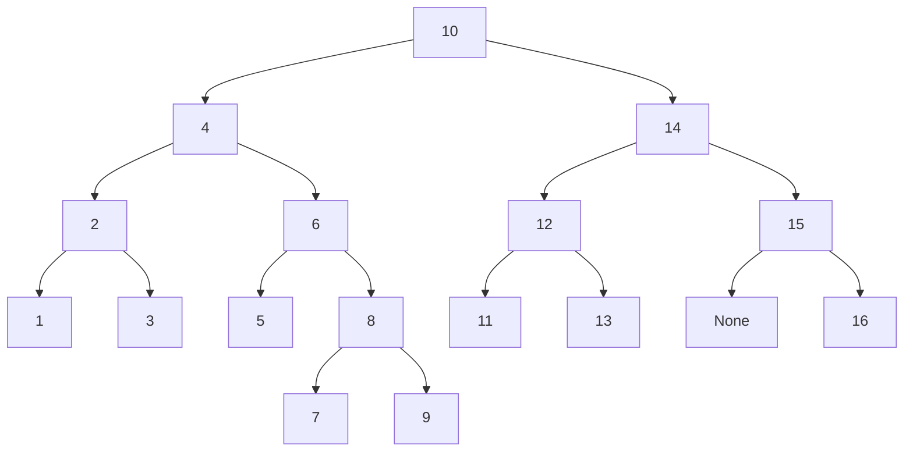

## Question 4

解释为什么 AVL 树中删除一个节点后最多有一个节点暂时失去高度平衡属性。

**Solution** 

首先，AVL 树的删除操作与二叉搜索树相同，对于叶子节点，直接删除；对于度为 1 的节点，删除后用子节点替代即可；对于度为 2 的节点，找到中序遍历顺序下的前一个节点 r ，替换后删除 r 。（r 一定是度为 1 或 0 的节点，因为中序遍历前一个节点，需要先向左，再向右直到找到最右的子节点。）

其次，平衡矛盾的节点一定在被删除的节点的祖先节点路径上，因为其他子树没有变化。

最后，对这个不平衡点而言，它的左右子树高度有一个 -1 ，但另一个不变，所以其祖先节点路径上的所有点高度不变，不存在其他不平衡的点。

## Question 5

请按如下操作顺序构建一棵伸展树，并展示操作步骤：插入 3 ，插入 2 ，插入 1 ，查询 4 ，插入 10 ，插入 6 ，删除 3 ，插入 7 ，查询 2 ，插入 13 ，删除 6 ，插入 5 。

**Solution**

插入 3


插入 2 ，旋转一次，将 2 移到根节点

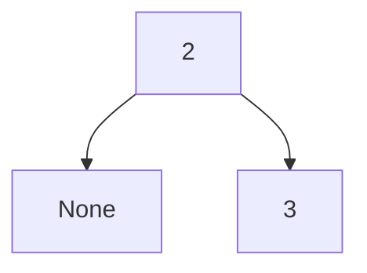

插入 1 ，旋转一次，将 1 移到根节点

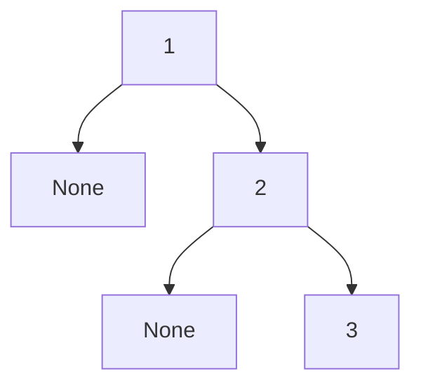

查询 4 ，未查询到，最后查询到叶子节点 3 ，将 3 伸展到根节点

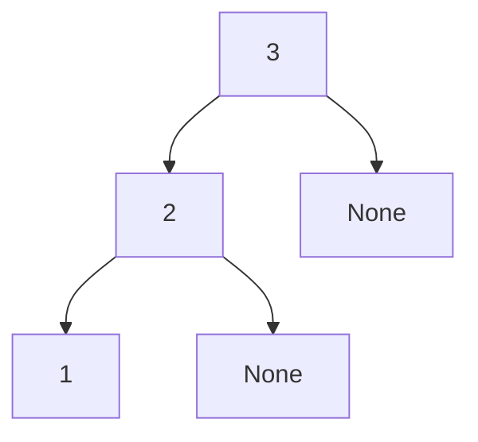

插入 10 ，旋转一次，将 10 伸展到根节点

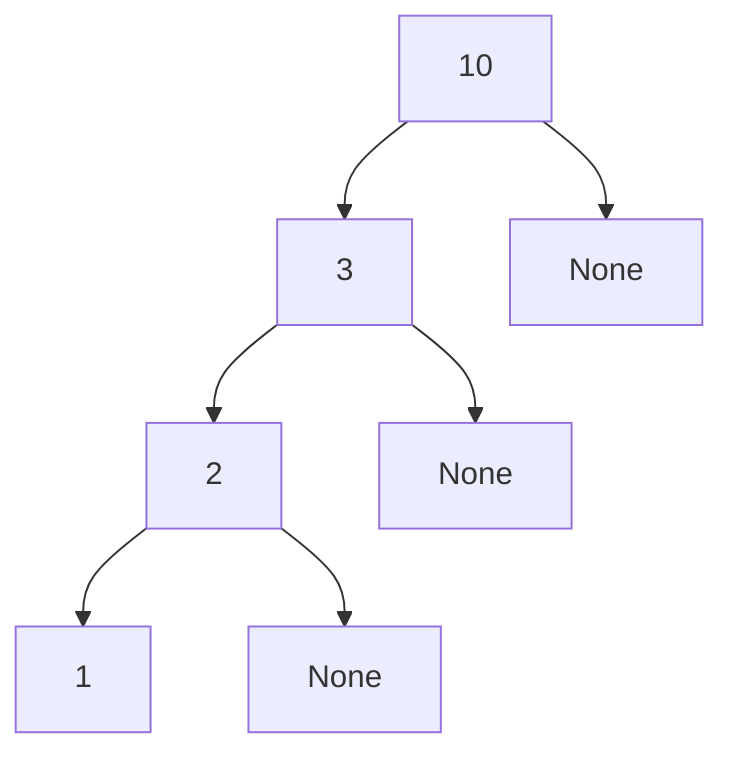

插入 6 ，将 6 伸展到根节点


删除 3 ，将 2 链接到 6 ，3 的父节点 6 已经是根节点，不用伸展

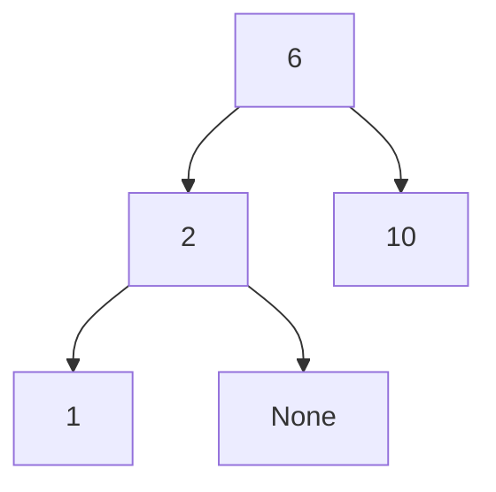

插入 7 ，将 7 伸展到根节点

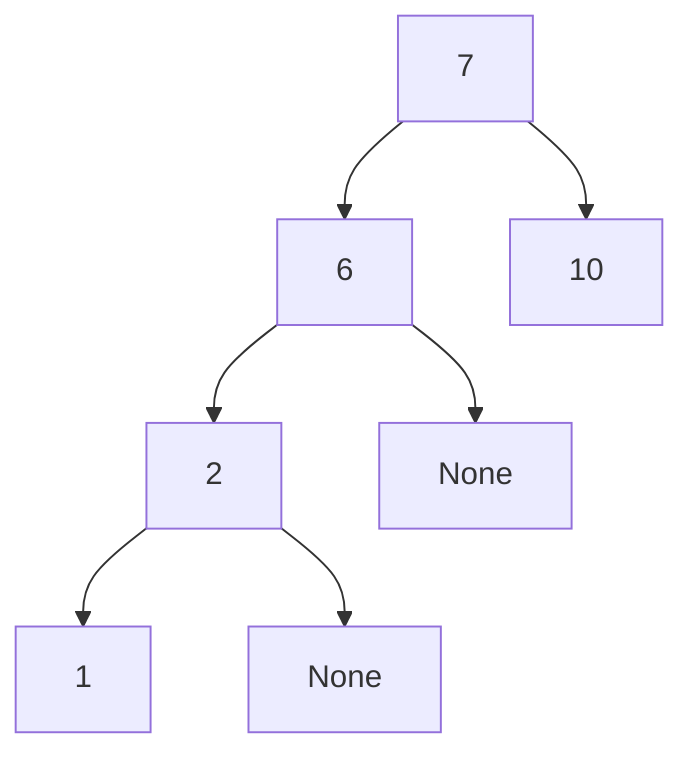

查询 2 ，并将 2 伸展到根节点

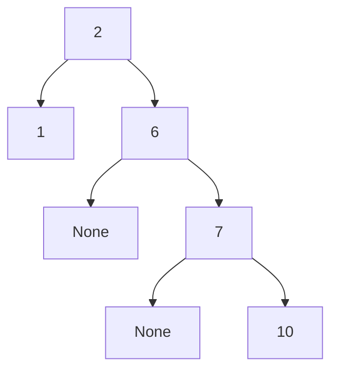

插入 13 ，将 13 伸展到根节点

先插入 13

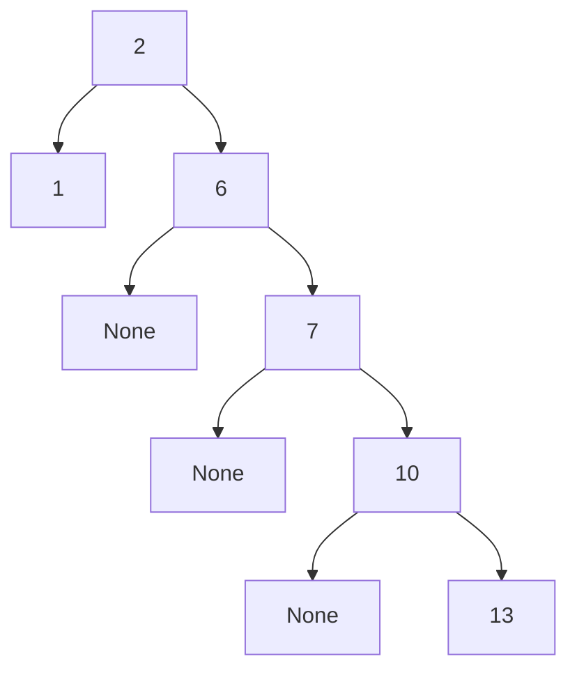

zig - zig 重构 1 次得到

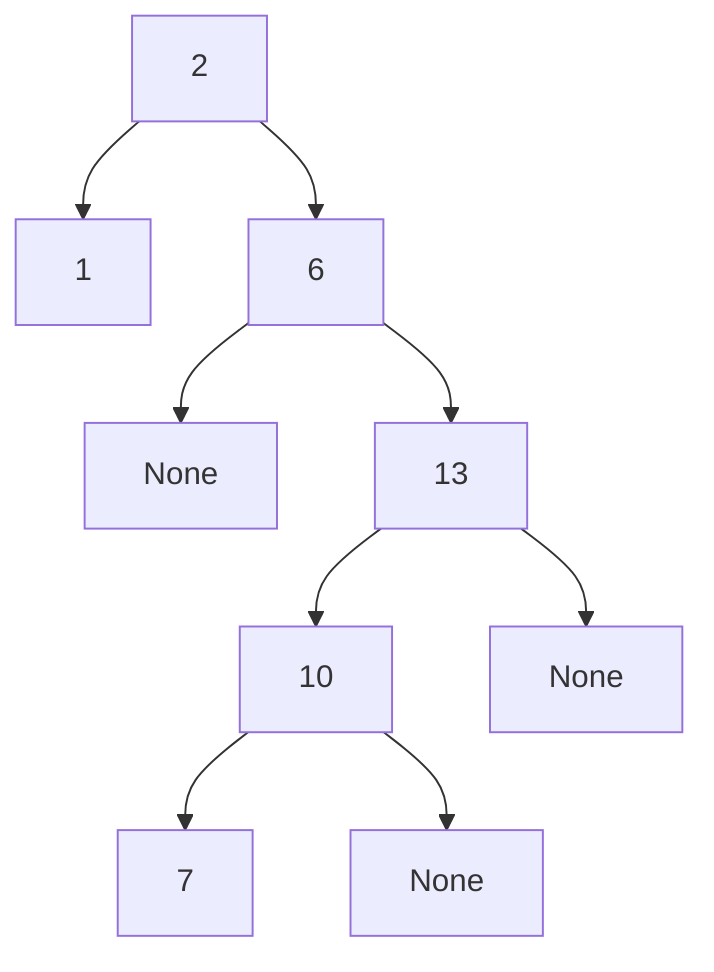

仍然是 zig - zig 型，重构一次得到

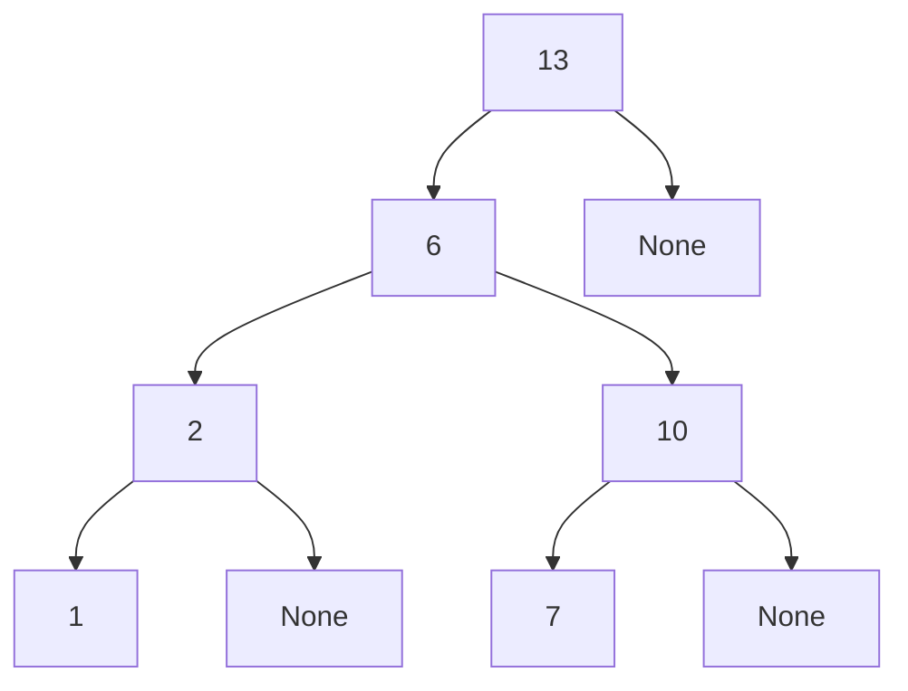

删除 6 ，将其前一个数 2 替换后删除

```mermaid
graph TD
	13 --> 2
	13 --> 1001[None]
	
	2 --> 1

	2 --> 10
	10 --> 7
	10 --> 101[None]
```

将被删除节点的父节点 2 伸展到根节点

```mermaid
graph TD
	2 --> 13
	13 --> 1000[None]
	
	2 --> 1

	13 --> 10
	10 --> 7
	10 --> 101[None]
```

插入 5 

```mermaid
graph TD
	2 --> 13
	13 --> 1000[None]
	
	2 --> 1

	13 --> 10
	10 --> 7
	10 --> 101[None]
	
	7 --> 5
	7 --> 200[None]
```

将 5 伸展到根节点（zig -zig）

```mermaid
graph TD
	2 --> 13
	13 --> 1000[None]
	
	2 --> 1

	13 --> 5
	

	5 --> 7
	5 --> 0[None]
	7 --> 6[None]
    7 --> 10
```

zig - zag 再重构一次

```mermaid
graph TD
	5 --> 2
	5 --> 13
	
	2 --> 1
	2 --> 100[None]
	
	13 --> 7
	13 --> 101[None]

	7 --> 0[None]
	7 --> 10
```

## Question 6

请采用归并排序，对序列 3，1，4，7，5，2，6，8 进行排序。

**Solution**

分割：

```mermaid
graph TD
	0[3, 1, 4, 7, 5, 2, 6, 8] --> 1[3, 1, 4, 7]
    0[3, 1, 4, 7, 5, 2, 6, 8] --> 2[5, 2, 6, 8]
	
	1[3, 1, 4, 7] --> 3[3, 1]
    1[3, 1, 4, 7] --> 4[4, 7]
    
    2[5, 2, 6, 8] --> 5[5, 2]
    2[5, 2, 6, 8] --> 6[6, 8]
    
    3[3, 1] --> 7[3]
    3[3, 1] --> 8[1]
    
    4[4, 7] --> 9[4]
    4[4, 7] --> 10[7]
    
    5[5, 2] --> 11[5]
    5[5, 2] --> 12[2]
    
    6[6, 8] --> 13[6]
    6[6, 8] --> 14[8]
```

合并：

```mermaid
graph BT
	1[1, 3, 4, 7] --> 0[1, 2, 3, 4, 5, 6, 7, 8]
    2[2, 5, 6, 8] --> 0[1, 2, 3, 4, 5, 6, 7, 8]
	
	3[1, 3] -->	1[1, 3, 4, 7]
    4[4, 7] --> 1[1, 3, 4, 7]
    
    5[2, 5] --> 2[2, 5, 6, 8]
	6[6, 8] --> 2[2, 5, 6, 8]
    
 	7[3] --> 3[1, 3]
    8[1] --> 3[1, 3]
    
    9[4] --> 4[4, 7]
	10[7] --> 4[4, 7]
    
    11[5] --> 5[2, 5]
    12[2] --> 5[2, 5]
    
    13[6] --> 6[6, 8]
    14[8] --> 6[6, 8]
```

## Question 7

在就地快速排序的实践中，另一种常用的基准值选取方法为三位取中法，即选取数组头部、正中间、尾部的三个数的中位数作为基准值。

1. 请实现这一算法。
2. 请使用这一算法，对序列 3，1，4，7，5，2，6，8 进行排序。

**Solution 1** 代码见  [hw3_7_in_place_quick_sort.py](hw3_7_in_place_quick_sort.py) 或者见下：

```python
def inplace_quick_sort(S: list, a: int, b: int) -> None:
    """就地快速排序: 序列 S 从 S[a] 到 S[b]"""
    if a >= b:
        return

    # 排序找出中位数 S[mid]
    mid = (a + b) // 2
    if S[a] > S[mid]:
        S[a], S[mid] = S[mid], S[a]
    if S[a] > S[b]:
        S[a], S[b] = S[b], S[a]
    if S[mid] > S[b]:
        S[mid], S[b] = S[b], S[mid]

    # 选择 S[a], S[mid], S[b] 的中位数作为 pivot
    pivot = S[mid]
    S[mid], S[b] = S[b], S[mid]  # 移到最右，直接以最右为基准
    left = a  # 从左向右
    right = b - 1  # 从右向左

    while left <= right:  # 直到相交
        while left <= right and S[left] < pivot:
            left += 1

        while left <= right and pivot < S[right]:
            right -= 1

        if left <= right:  # 逆序, 则交换
            S[left], S[right] = S[right], S[left]  # 交换
            left, right = left + 1, right - 1  # 继续移动

    S[left], S[b] = S[b], S[left]  # 将基准值放回中间

    # 递归调用
    inplace_quick_sort(S, a, left - 1)
    inplace_quick_sort(S, left + 1, b)


if __name__ == '__main__':
    S = [85, 24, 63, 45, 17, 31, 96, 50]

    print("=" * 15, "Original List", "=" * 15)
    print(S)

    print("=" * 15, "After Sorted", "=" * 15)
    inplace_quick_sort(S, 0, len(S) - 1)
    print(S)
```

**Solution 2** 对序列 `3, 1, 4, 7, 5, 2, 6, 8` 进行三位取中的快速排序。

注意：我们的算法，先将中位数移到序列末尾；之后再重新移回中间。

|  Step  |                                |                                |                                |                                |                                |                                |                                |                                |
| :----: | :----------------------------: | :----------------------------: | :----------------------------: | :----------------------------: | :----------------------------: | :----------------------------: | :----------------------------: | :----------------------------: |
| **1**  |               3                |               1                |               4                |               7                |               5                |               2                |               6                |               8                |
| **2**  |               3                |               1                |               4                |               8                |               5                |               2                |               6                | <b style = "color: red">7</b>  |
| **3**  |               3                |               1                |               4                |               6                |               5                |               2                |               8                | <b style = "color: red">7</b>  |
| **4**  |               3                |               1                |               4                |               6                |               5                |               2                |               7                | <b style = "color: blue">8</b> |
| **5**  |               3                |               1                |               4                |               7                |               5                |               2                | <b style = "color: red">6</b>  | <b style = "color: blue">8</b> |
| **6**  |               3                |               1                |               4                |               2                |               5                |               7                | <b style = "color: red">6</b>  | <b style = "color: blue">8</b> |
| **7**  |               3                |               1                |               4                |               2                |               5                | <b style = "color: blue">6</b> | <b style = "color: blue">7</b> | <b style = "color: blue">8</b> |
| **8**  |               3                |               1                |               5                |               2                | <b style = "color: red">4</b>  | <b style = "color: blue">6</b> | <b style = "color: blue">7</b> | <b style = "color: blue">8</b> |
| **9**  |               3                |               1                |               2                |               5                | <b style = "color: red">4</b>  | <b style = "color: blue">6</b> | <b style = "color: blue">7</b> | <b style = "color: blue">8</b> |
| **10** |               3                |               1                |               2                | <b style = "color: blue">4</b> | <b style = "color: blue">5</b> | <b style = "color: blue">6</b> | <b style = "color: blue">7</b> | <b style = "color: blue">8</b> |
| **11** |               3                |               1                | <b style = "color: red">2</b>  | <b style = "color: blue">4</b> | <b style = "color: blue">5</b> | <b style = "color: blue">6</b> | <b style = "color: blue">7</b> | <b style = "color: blue">8</b> |
| **12** |               1                |               3                | <b style = "color: red">2</b>  | <b style = "color: blue">4</b> | <b style = "color: blue">5</b> | <b style = "color: blue">6</b> | <b style = "color: blue">7</b> | <b style = "color: blue">8</b> |
| **13** | <b style = "color: blue">1</b> | <b style = "color: blue">2</b> | <b style = "color: blue">3</b> | <b style = "color: blue">4</b> | <b style = "color: blue">5</b> | <b style = "color: blue">6</b> | <b style = "color: blue">7</b> | <b style = "color: blue">8</b> |

Step 2 基准 7 移到最后

Step 3 交换 8 和 6 

Step 4 相交，基准值移回中间（交换 S[left] 和 S[b]）

Step 5 基准 6 移到最后

Step 6 交换 7 和 2

Step 7 相交，基准值移回中间（交换 S[left] 和 S[b]）

Step 8 基准 4 移到最后

Step 9 交换 5 和 2

Step 10 相交，基准值移回中间（交换 S[left] 和 S[b]）

Step 11 基准为 2

Step 12 交换 3 和 1

Step 13 相交，基准值移回中间（交换 S[left] 和 S[b]）