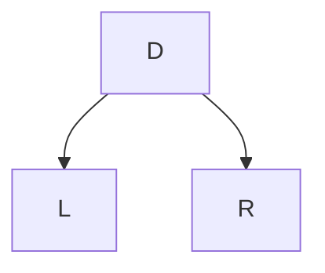

# 树的遍历算法

**树的遍历**常见方案：前序遍历 (preorder traversal) ，后序遍历 (postorder traversal) ，二叉树的中序遍历 (inorder traversal) ，层序遍历/广度优先遍历 (level order traversal/breadth-first traversal) 。

## 1 树的遍历算法

树的遍历（traversal）：按某种规则不重复地访问树的所有节点

- 前序遍历（preorder traversal）：先访问根，再递归访问子树。如树有序，则按顺序访问子树。
- 后序遍历（postorder traversal） ：先递归访问子树，再访问根。如树有序，则按顺序访问子树
- 二叉树的中序遍历（inorder traversal）：先递归访问左孩子，再访问根节点，再递归访问右孩子。
- 层序遍历/广度优先遍历（level order traversal/breadth-first traversal）：按层为顺序遍历，每一层从左到右遍历。

以二叉树的遍历算法为例，可直观的理解为：设二叉树由根𝐷 、左子树𝐿和右子树𝑅构成

- 前序遍历：`D -> L -> R`
- 后序遍历：`L -> R -> D`
- 中序遍历：`L -> D -> R`
- 层序遍历：从低到高逐层，从左到右遍历



### 1.1 深度优先

#### 1.1.1 前序遍历

在树 T 的**前序遍历**中，首先访问 T 的根，然后递归地访问子树的根。如果这棵树是有序的，则根据孩子的顺序遍历子树。伪代码：

```python
Algorithm preOrder(T, p):
	visit(p)
	for each child c in T.children(p) do
		preOrder(T, c)
```

可以递归理解：对每一个节点，逐步进行如下操作

1. 访问根节点
2. 前序遍历左子树
3. 前序遍历右子树

例如：在打印章节时，按照章节顺序打印


#### 1.1.2 后序遍历

**后序遍历**可以看作相反的前序遍历，它优先遍历子树的根，即首先从孩子的根开始，然后访问根（因此叫作后序）。伪代码：

```python
Algorithm postOrder(T, p):
	for each child c in T.children(p) do
		postOrder(T, c)
	visit(p)
```

可以递归理解：对每一个节点，逐步进行如下操作

1. 后序遍历左子树
2. 后序遍历右子树
3. 访问根节点

例如：反向打印章节


#### 1.1.3 二叉树的中序遍历

在**中序遍历**中，我们通过递归遍历左右子树后再访问根节点。伪代码：

```python
Algorithm inOrder(T, p):
	if p has a left child lc then
		inOrder(T, lc)
	visit(p)
	if p has a right child rc then
		inOrder(T, rc)
```

可以递归理解：对每一个节点，逐步进行如下操作

1. 中序遍历左子树
2. 访问根节点
3. 中序遍历右子树

例如：表达式树


#### 1.1.4 算法分析

前/中/后序遍历均为**深度优先**遍历算法，可用递归实现，也可用模拟递归栈的方式进行非递归实现。

递归栈的最大深度和树的深度保持一致：

- 最好情况，空间复杂度 `O(log n)` 。
- 最坏情况，空间复杂度 `O(n)` 。

因为是遍历，所以时间复杂度为 `O(n)` 。

### 1.2 广度优先：层序遍历

用**广度优先**遍历算法，即**层序遍历**算法。在访问深度 d 的位置之前先访问深度 d+1 的位置。按照层次自低向高，每层从左向右访问。伪代码：

```python
Algorithm breadthfirst(T):
    Initialize queue Q to contain T.root()
    while Q not empty do
        p = Q.dequeue()
        visit(p)
        for each child c in T.children(p) do
        	Q.enqueue(c)
```

无法用递归实现，借助队列理解：

- 先将根节点入队
- 每出队一个节点，将其孩子节点依次放入队列

例如：下面实现了对一个树的逐步层序遍历。


## 2 Python 实现树遍历

首先，继续上一章 [树与二叉树](https://blog.iskage.online/posts/7542010b.html#1-5-树的基类-Python-实现) 定义的 `Tree` 类进行补充。先定义 `__iter__` 方法，产生迭代器，其中的 `positions()` 方法就可以用于指代不同的遍历方式。这个迭代器只是可以使用 `for i in obj` 的方式直接获取 `element` 值，而非 `Position` 节点类。

```python
def __iter__(self):
    """定义迭代器：遍历方式可选"""
    for p in self.positions():  # positions() 可选不同的遍历方式
        yield p.element()
```

### 2.1 前序遍历

在 `Tree` 类后继续补充 `preorder` 方法和 `_subtree_preorder` 方法

```python
def preorder(self):
    """前序遍历"""
    if not self.is_empty():
        for p in self._subtree_preorder(self.root()):  # 递归实现
            yield p

def _subtree_preorder(self, p):
    """前序遍历子树"""
    yield p  # 访问根节点
    for c in self.children(p):  # 遍历子树
        for other in self._subtree_preorder(c):
            yield other
```

然后知道 `positions()` 方法为 `preorder()` 前序遍历。

```python
def positions(self):
    """指定遍历方法"""
    return self.preorder()
```

或者直接继承 `Tree` 父类，覆写子类 `PreorderTree` 类。

```python
class PreorderTree(Tree):
    # ---------------- 遍历算法 ----------------
    # 迭代器
    def __iter__(self):
        """定义迭代器：遍历方式可选"""
        for p in self.positions():  # positions() 可选不同的遍历方式
            yield p.element()

    # 前序遍历
    def preorder(self):
        """前序遍历"""
        if not self.is_empty():
            for p in self._subtree_preorder(self.root()):  # 递归实现
                yield p

    def _subtree_preorder(self, p):
        """前序遍历子树"""
        yield p  # 访问根节点
        for c in self.children(p):  # 遍历子树
            for other in self._subtree_preorder(c):
                yield other

    def positions(self):
        """指定遍历方法"""
        return self.preorder()
```

### 2.2 后序遍历

同理，为清晰展示，后面采用继承的方法，子类覆写。

```python
class PostorderTree(Tree):
    # ---------------- 遍历算法 ----------------
    # 迭代器
    def __iter__(self):
        """定义迭代器：遍历方式可选"""
        for p in self.positions():  # positions() 可选不同的遍历方式
            yield p.element()

    # 后序遍历
    def postorder(self):
        """后序遍历"""
        if not self.is_empty():
            for p in self._subtree_postorder(self.root()):  # 开始递归
                yield p

    def _subtree_postorder(self, p):
        """后序遍历子树"""
        for c in self.children(p):  # 后序遍历子树
            for other in self._subtree_postorder(c):
                yield other
        yield p  # 访问根节点

    def positions(self):
        """指定遍历方法"""
        return self.postorder()
```

### 2.3 二叉树的中序遍历

此处是在二叉树类 `BinaryTree` 类中实现，见  [树与二叉树](https://blog.iskage.online/posts/7542010b.html#2-6-二叉树新增方法的-Python-实现) 。为简单起见，也采用继承 `BinaryTree` 的方式定义一个新的类 `InorderTree` 。

```python
class InorderTree(BinaryTree):
    # ---------------- 遍历算法 ----------------
    # 迭代器
    def __iter__(self):
        """定义迭代器：遍历方式可选"""
        for p in self.positions():  # positions() 可选不同的遍历方式
            yield p.element()

    # 前序遍历
    def inorder(self):
        """中序遍历"""
        if not self.is_empty():
            for p in self._subtree_inorder(self.root()):  # 递归实现
                yield p

    def _subtree_inorder(self, p):
        """中序遍历子树"""
        if self.left(p) is not None:  # 遍历左子树
            for other in self._subtree_inorder(self.left(p)):
                yield other
        yield p  # 访问根节点
        if self.right(p) is not None:  # 遍历右子树
            for other in self._subtree_inorder(self.right(p)):
                yield other

    def positions(self):
        """指定遍历方法"""
        return self.inorder()
```

### 2.4 广度优先：层序遍历

为简单起见，直接在 `Tree` 基础类中加入新方法 `breadthfirst` 。其中 `LinkedQueue` 类是用链表实现的队列结构，具体可见 [队列 Queue](https://blog.iskage.online/posts/583f8c56.html#4-基于单向链表的队列实现) 。

```python
def breadthfirst(self):
    """广度优先：层序遍历"""
    if not self.is_empty():
        fringe = LinkedQueue()  # 队列实现
        fringe.enqueue(self.root())  # 根节点入队

        while not fringe.is_empty():
            p = fringe.dequeue()  # 取出头部
            yield p  # 生成

            for c in self.children(p):  # 将子节点入队
                fringe.enqueue(c)
```


## 3 树的遍历的应用

### 3.1 前序遍历：目录表

树的前序遍历可以自然地被用于产生文档或书籍的目录表：

- 如不需要缩进，则可直接使用**前序遍历**打印目录表
- 如需要缩进，则需要定义一个特殊的前序遍历函数


**代码实现**

```python
def preorder_indent(T, p, d):
    """前序遍历：打印目录
    :param T: 目录树
    :param p: 当前节点
    :param d: 记录深度
    """
    print(2 * d * ' ' + str(p.element()))  # 记录深度
    for c in T.children(p):
        preorder_indent(T, c, d + 1)  # 递归打印子树
```

### 3.2 后序遍历：计算磁盘空间

计算磁盘空间：

- 计算磁盘空间需要将文件系统表示为树后，使用**后序遍历**
- 需要定义一个特殊的后序遍历函数记录当前占有的存储空间


**代码实现**

```python
def disk_space(T, p):
    """计算文件系统树，p 节点后的总磁盘空间
    :param T: 文件系统树
    :param p: 当前节点
    """
    subtotal = p.element().space()  # 节点 p 占有的空间
    for c in T.children(p):  # 计算 p 的子树总空间
        subtotal += disk_space(T, c)  # 递归计算子树空间
    return subtotal
```

### 3.3 中序遍历：打印表达式

表达式树是一棵**二叉树**，使用表达式树输出表达式需要一种特殊的**中序遍历**算法：

- 访问节点时输出节点存储的值或运算符
- 遍历左子树前输出 `(`
- 遍历右子树后输出 `)`


**伪代码**

```python
Algorithm printExpression(v)：
    if v has a left child
        print("(")
        printExpression(left(v))
    print(v.element())
    if v has a right child
        printExpression(right(v))
        print (")")
```

### 3.4 后序遍历：计算表达式

使用表达式树计算表达式的值需要一种特殊的**后序遍历**：

- 使用递归返回子树的值
- 访问内部节点时，使用内部节点的运算符对左、右子树的值做运算

**伪代码**

```python
Algorithm evalExpr(v):
    if is_leaf (v)
    	return v.element()
    else
        x = evalExpr(left(v))
        y = evalExpr(right(v))
        op = operator stored at v
	    return x  y
```

### 3.5 后序遍历：剪去值为 0 的子树

给定一棵二叉树，假设其根节点为 `root` ，此二叉树的所有节点为 `0` 或 `1` 。请剪除该二叉树中所有节点的值均为 `0` 的子树。即若对于 p 节点，它的子节点 q 和以 q 为根节点的子树的值均为 0 ，则删去 q 子树。

**后序遍历**：先对子树进行剪枝、再对当前节点进行剪枝。

例如：原始左边的树被剪为右边的树

```python
        1					1	
       / \					 \
      0   1        ->         1
     / \ / \				   \
    0  0 0  1					1
```

代码实现

为简单起见，先定义节点类（右视图同样沿用这个定义）

```python
class TreeNode:
    def __init__(self, val=1, left=None, right=None):
        self.val = val
        self.left = left
        self.right = right

    def add_left(self, val):
        new = TreeNode(val)
        if self.left is None:
            self.left = new
        return new

    def add_right(self, val):
        new = TreeNode(val)
        if self.right is None:
            self.right = new
        return new
```

剪枝函数：

```python
def pruneTree(root: TreeNode):
    def should_prune(node: TreeNode):
        if not node:
            return False

        # 处理左子树
        left_prune = should_prune(node.left)  # 递归查看是否能剪枝
        if left_prune:
            node.left = None  # 剪去

        # 处理右子树
        right_prune = should_prune(node.right)  # 递归查看是否能剪枝
        if right_prune:
            node.right = None  # 剪去

        # 判断当前节点是否可以被剪掉
        return node.val == 0 and node.left is None and node.right is None

    if should_prune(root):
        return None  # root 也被剪去

    return root
```

结果

```python
=============== Before Prune ===============
1
0 1
0 0 0 1
=============== After pruning ===============
1
1
1
```

### 3.6 树的右视图：深度/广度优先

给定一棵**二叉树**，假设其根节点为 `root` 。想象站在它的右侧，按照从顶部到底部的顺序，返回从右侧所能看到的节点值（即二叉树的“右视图”）。

**思路 1：深度优先搜索**

- 使用特殊的**前序遍历**：先访问右子树、再访问左子树
- 遍历时，同时记录当前节点深度，以及一个记录在不同深度碰到的第一个节点的数组
- 遍历结束后，数组中的结果即为树的“右视图”

代码实现

```python
def DFS_rightSideView(root: TreeNode):
    result = []  # 存放右视图

    def dfs(node, depth):
        if not node:
            return
        if depth == len(result):
            result.append(node.val)  # 最右一个元素

        # 递归
        dfs(node.right, depth + 1)
        dfs(node.left, depth + 1)

    dfs(root, 0)  # 初始 root 根节点
    return result
```

结果

```python
=============== Initial Tree ===============
1
3 2
0 4 0 3
=============== Right Side View ===============
[1, 2, 3]
```

**思路 2：广度优先搜索**

- 使用特殊的**层序遍历**，每一层最后一个访问的节点即为树“右视图”中能看到的该层节点
- 使用队列作为辅助结构，可以同时记录下当前深度，或用不同队列记录不同层的遍历结果

代码实现

```python
def BFS_rightSideView(root: TreeNode):
    if not root:
        return []

    result = []  # 存放右视图
    queue = [root]  # 辅助队列

    while queue:  # 队列非空
        size = len(queue)  # 树这一层的节点数
        for i in range(size):
            node = queue.pop(0)  # 头部出队

            if i == size - 1:
                # 最后一个节点：进入右视图结果列表 result
                result.append(node.val)

            # 否则子树进队
            if node.left:
                queue.append(node.left)
            if node.right:
                queue.append(node.right)
    return result
```

结果

```python
=============== Initial Tree ===============
1
3 2
0 4 0 3
=============== Right Side View ===============
[1, 2, 3]
```


